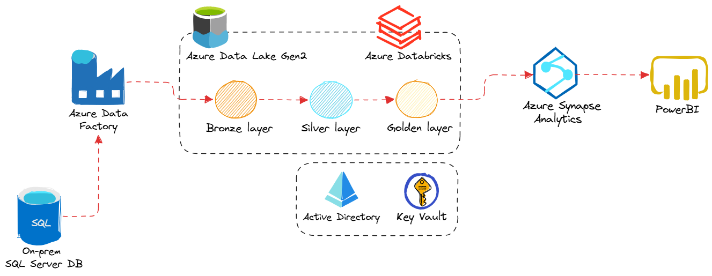

# End-to-end credit risk pipeline



# 0. Setup
Here are just the summary for setup phase. For details see [Detailed setup](docs/setup.md)

## On-premises
1. SQL Server 2025 Developer - Enterprise Developer edition
2. SQL Server Management Studio 22

## Azure
Create these resources **in order**:
1. Resource Group — a container that holds all project resources
2. Azure Data Lake Storage Gen2 (ADLS Gen2) — Bronze/Silver/Gold storage
3. Azure Data Factory (ADF) — for the pipelines
4. Azure Databricks — for transformations
5. Azure Synapse Analytics — for querying
6. Azure Key Vault — for storing secrets/credentials
7. Microsoft Entra ID — already exists, just need to configure (create SP, assign SP roles and SP indenties)

# 1. Data ingestion
## Microsoft Integration Runtime (IR)
- **ADF side**: Open ADF Studio and create Integration Runtime
- **On-prem side**: Download and install integration runtime

## Copy Pipeline
In **Azure Data Factory Studio**:
- Create linked service **(called ls_sql)** for on-prem SQL Server with SQL authentication.
- Create linked service **(called ls_adls)** for ADLS Gen2
- Create **Copy All Data Pipeline** (dynamically loop all tables) 
    - Lookup
        ```sql
        SELECT TABLE_NAME 
        FROM INFORMATION_SCHEMA.TABLES 
        WHERE TABLE_TYPE = 'BASE TABLE'
        ```
    - ForEach:
    ``` @activity('lookup-all-tables').output.value ```
    - Copy data (insisde ForEach): **source** using ls_adls and **sink** using ls_adls. Dynamic query: ``` @concat('SELECT * FROM ', item().TABLE_NAME) ```

# 2. Data transformation
- Create Databricks cluster
- Mount Azure Data Lake Storage Gen2 in Databricks
- Bronze → Silver notebook
- Silver → Gold notebook (store Gold data in Delta format)
- Integrate notebooks into ADF pipeline

# 3. Data loading
- Create a linked service in Synapse for ADLS Gen2
- Create a Synapse Pipeline that:
    - Retrieves table names from the Gold folder
    - Executes a Stored Procedure for each table
    - Creates/updates Views in the Serverless SQL pool (point to Gold files)

# 4. Data reporting
- Install Microsoft Power BI
- Connect to Azure Synapse Analytics SQL
- Create a new dashboard

# 5. End-to-end pipeline testing
- Create scheduled trigger in ADF (daily)
- Test full pipeline run (extract → load → transform)
- Verify Power BI dashboard refreshes correctly
[Pipeline testing](docs/pipeline_testing.png)